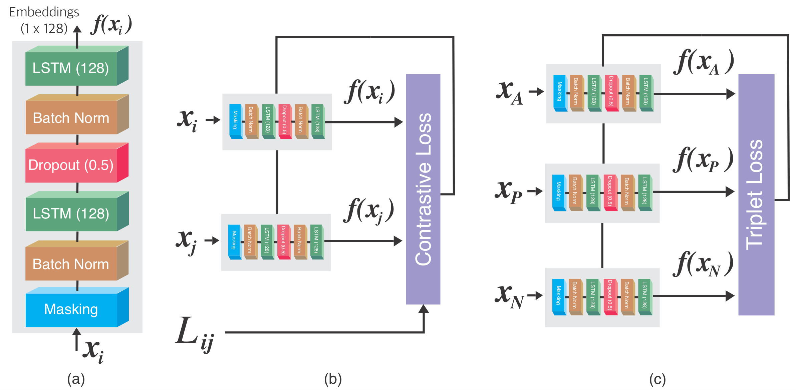
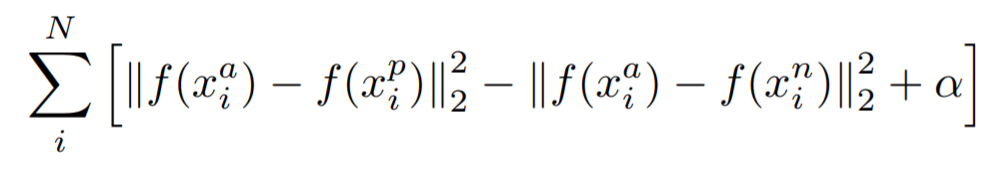

# Typenet_Triplet_Loss
 
The TypeNet architecture is an SNN (Siamese Neural Network). SNN is a class of neural network architectures that contain two or more identical sub-networks with identical configurations, parameters, and weights. Parameter updating is mirrored across both sub-networks and the sub-networks have shared weights.

The TypeNet architecture, (a) as shown below, consists of a masking layer which prevents the model from training based on the zero padded values, batch normalization layers, two LSTM layers of 128 units each (tanh activated), and a dropout layer (0.5) as a regularization technique to prevent overfitting. The masking layer prevents the zeros from contributing to the model’s loss function. Therefore, error gradients will not be computed for those zeros and they do not affect the performance of the model. The Triplet loss architecture is shown in (c).
  

LSTM model sequences with fixed length (number of keystrokes). Therefore, keystrokes data that are lesser than the required fixed length are zero padded, and keystrokes data that are greater than the required fixed length are truncated.

<h3><strong>Loss Function</strong></h3>
The Triplet loss function compares a baseline input (anchor) to both a positive input and a negative input. The positive input is from the same subject as the anchor, whereas the negative input is from a different subject as the anchor. The goal is to minimize the distance between the anchor and the positive embeddings, while maximizing the distance between the anchor and the negative embeddings.
  

